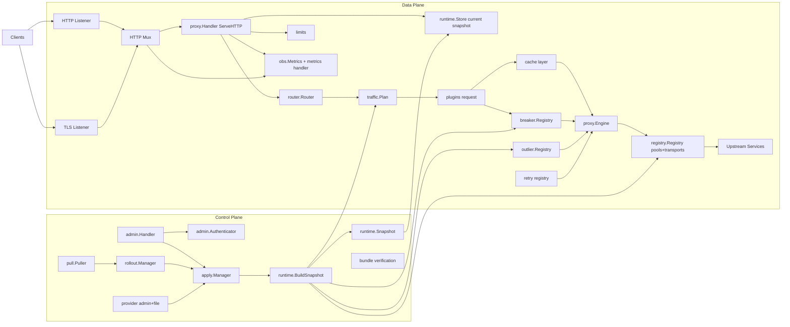

# Architecture Overview

Snapshots are immutable; each config update builds a new snapshot and swaps it atomically. Runtime registries hold shared state such as pools, breakers, and outlier tracking.
